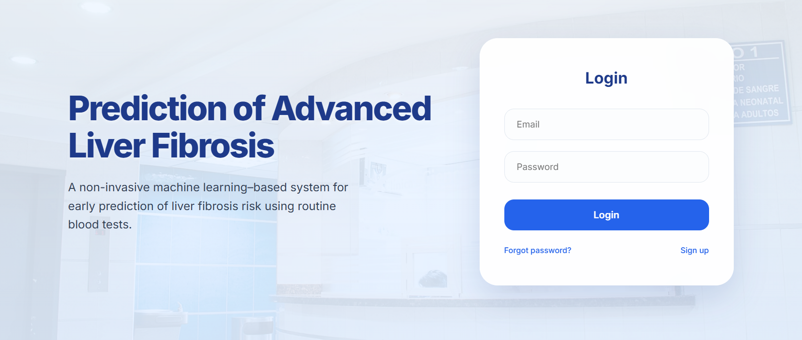
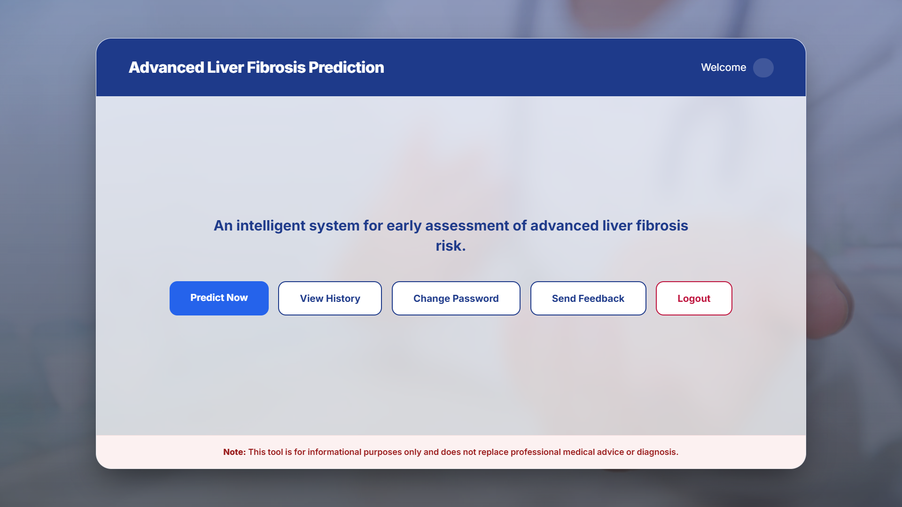
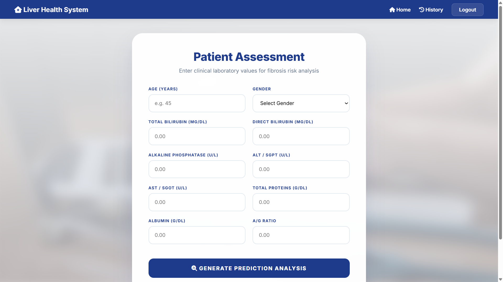
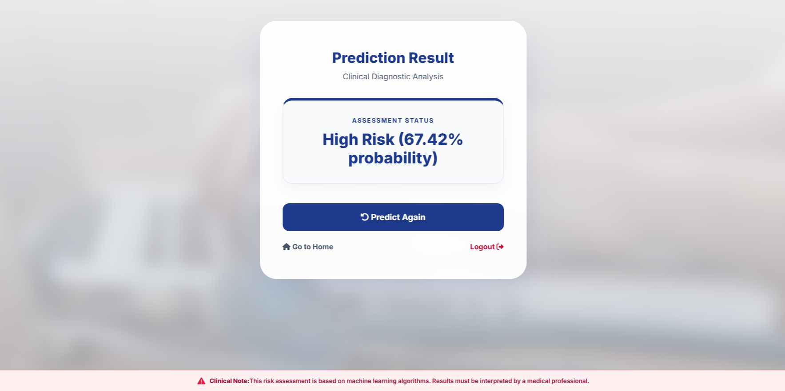
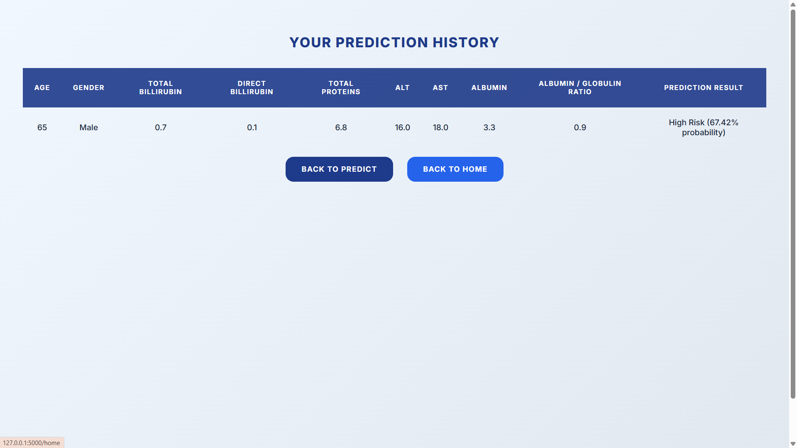
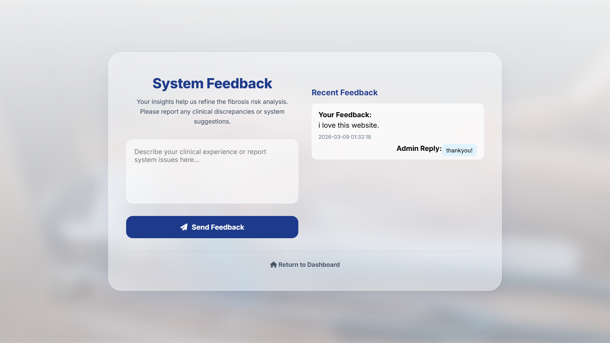
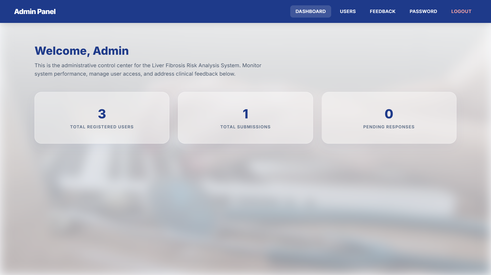
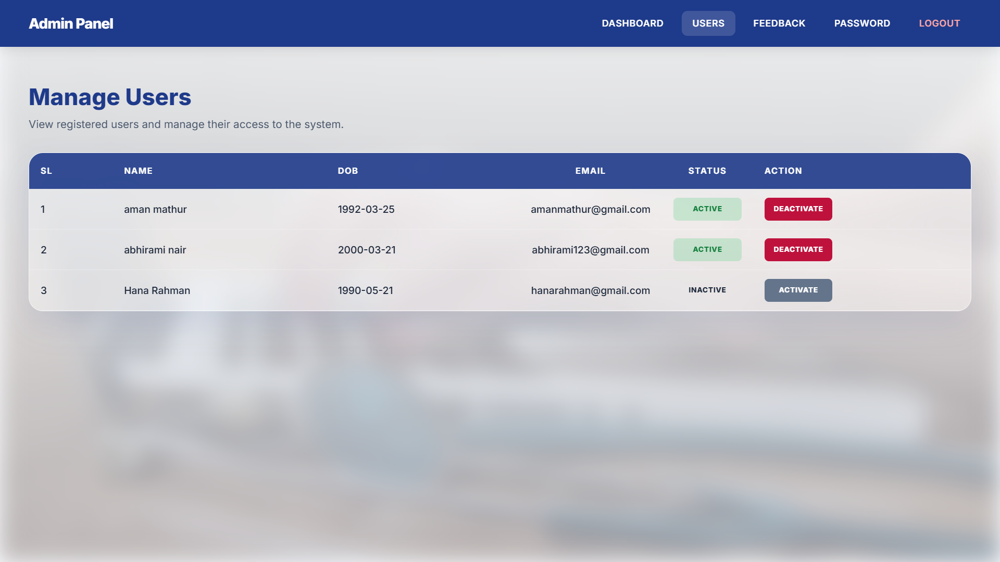
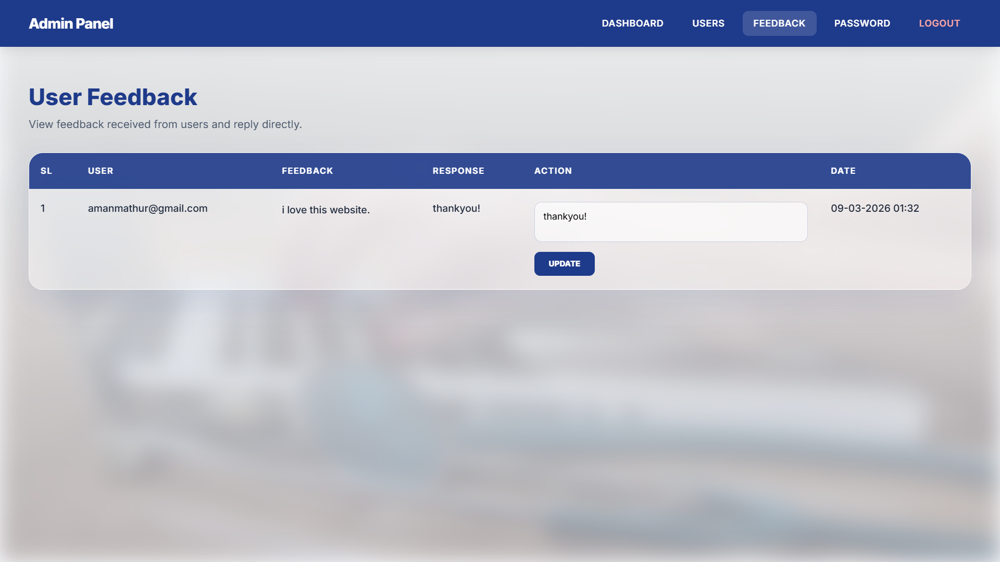

# Liver Fibrosis Prediction System
A Machine Learning–based healthcare web application developed for predicting advanced liver fibrosis risk using routine blood test parameters.
The system provides an easy-to-use interface for users and an administrative dashboard for managing users and feedback.

---

## Features

### User Module

* User Registration & Login
* Secure Password Hashing
* Liver Fibrosis Prediction
* Prediction History Tracking
* Feedback Submission
* Admin Reply Viewing
* Change Password

### Admin Module

* Admin Dashboard
* User Management
* User Access Management
* Feedback Management & Response
* View System Records

---

## Machine Learning Model

The project uses supervised machine learning algorithms for fibrosis prediction.

### Algorithms Tested

* Logistic Regression
* Random Forest
* Decision Tree

### Selected Model

**Logistic Regression** was selected based on:

* Higher Accuracy
* Better Recall Performance
* Simpler and Efficient Classification

---

## Technologies Used

### Front End

* HTML
* CSS
* JavaScript

### Back End

* Python

### Framework

* Flask

### Database

* MySQL

### Machine Learning

* Scikit-learn
* Pandas
* NumPy

---

## System Modules

* Authentication Module
* Prediction Module
* History Module
* Feedback Module
* Admin Management Module

---

## Screenshots

### Login Page



### User Dashboard



### Prediction Page



### Prediction Result



### Prediction History



### Feedback Page



### Admin Dashboard



### Manage Users



### Feedback Management



---

## Installation

### Clone Repository

```bash
git clone https://github.com/ridarasheed/liver-fibrosis-prediction-system.git
```

### Install Requirements

```bash
pip install -r requirements.txt
```

### Configure Environment Variables

Create a `.env` file and add:

```env
DB_HOST=localhost
DB_USER=your_mysql_username
DB_PASSWORD=your_mysql_password
DB_NAME=your_database_name
```

### Run Application

```bash
python app.py
```

---

## Future Enhancements

* Email-based Password Reset
* Improved ML Accuracy using Advanced Models
* Cloud Deployment
* Medical Report Upload Support
* Real-time Analytics Dashboard

---

## Team Members

* Rida Rasheed
* Rithika P
* Swathi Dinesh
* Vismaya Rajesh A M

---

## Project Type

Machine Learning-based Healthcare Web Application

---
